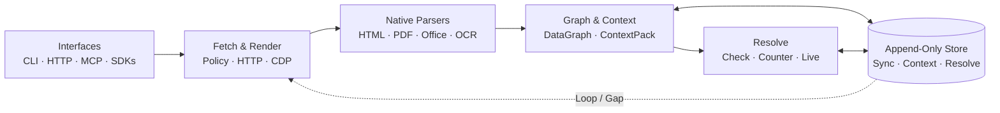
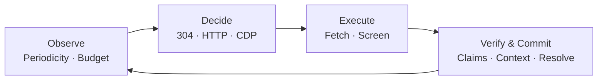
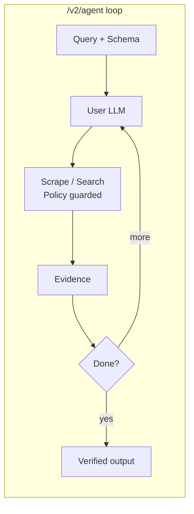
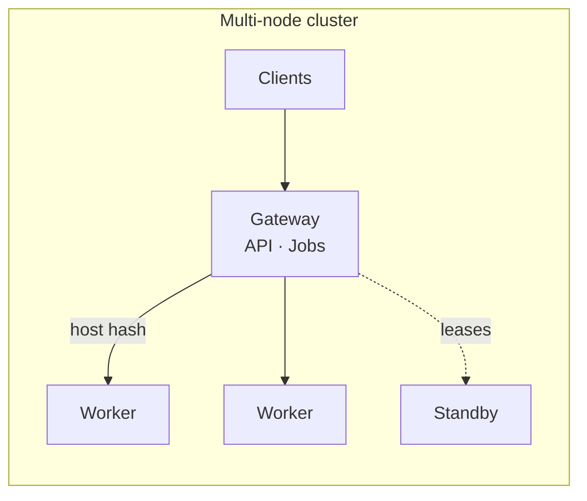

<div align="center">


# pagesift 1.7.0

**Local-first web & document ingestion engine in Rust — HTTP/browser capture, layout-aware PDF/Office/OCR parsing, persistent sync, verifiable data graphs, evidence-grounded AI context, and live claim resolution.**  
One self-hosted Rust binary with a CLI, Firecrawl v1/v2 & Jina Reader HTTP APIs, an MCP server, a C ABI, and native Python / Node.js packages.

[](LICENSE)
[](docs/COMMERCIAL.md)
[](https://github.com/YOLOW92/pagesift/releases)
[](https://crates.io/crates/pagesift)
[](https://pypi.org/project/pagesift/)
[](https://www.npmjs.com/package/@pagesift/node)
[](https://glama.ai/mcp/servers/YOLOW92/pagesift)
[](https://discord.gg/esA3wMZVvA)

**English** · [简体中文](docs/README.zh-CN.md) · [日本語](docs/README.ja.md) · [Español](docs/README.es.md)

</div>

<!-- readme-template: v2 -->
<!-- section: overview -->
## Overview

`pagesift` turns live web pages, uploaded binary documents, archives, and long-lived monitored sources into clean Markdown, schema-validated JSON, provenance-tracked `DataGraph` relations, budget-compiled `ContextPack` evidence, and persistent incrementally verified `Resolve` conclusions inside a single memory-bounded Rust binary. HTTP fetching, native document readers, HTML extraction, adaptive sync state, incremental context indexing, deterministic seven-layer claim resolution, and evidence storage run in-process without requiring Python, JVM, or Node workers; a headless browser pool, NVIDIA GPU OCR, and user-configured LLM endpoints attach only when requested.

Drop-in or companion for: **Firecrawl** (self-hosted v1/v2 API), **Jina Reader** (`/r/` and `/s/`), **Crawl4AI**, **trafilatura**, **Readability**, **pymupdf4llm**, **Docling**, **Kreuzberg**, and **xberg**.

<!-- section: sponsors -->
## Sponsors

<a href="https://proxy-seller.com/?partner=9CCCBD6151334AC0"></a>

> Affiliate link: the project may earn a commission on purchases.

[**Proxy-Seller**](https://proxy-seller.com/?partner=9CCCBD6151334AC0) sponsors pagesift: residential, ISP and datacenter proxy IPs (IPv4/IPv6), 220+ geos, 24/7 support. Use promo code `PAGESIFT` for 15% off ISP / IPv4 / residential proxies.

<!-- section: facts -->
## At a glance

- **Layered runtime:** Entry surfaces (`CLI` / `HTTP` / `MCP` / FFI) → policy & SSRF-guarded net → adaptive strategy (`HTTP` / embedded JSON / browser) → native format readers → `DataGraph`, `Context`, `Resolve` & append-only store → cgroup-sized NUMA worker pool (`pagesift-flow`)
- **Inputs:** URLs, HTML, PDF (text + optional PP-OCRv6 / formulas), uploaded images (OCR when enabled), Office & OpenDocument, RTF/WordPerfect/HWP, e-books, emails, archives (`zip`, `tar`, `7z`), SQLite/CSV, 373 code languages, and WARC ([format matrix](docs/parse-api.md))
- **Outputs:** Markdown, HTML, raw HTML, links, images/attachments, RAG chunks, schema JSON, `DataGraph` (`graph.jsonl`, citations, claim lifecycles, conflicts, `fact_clusters`, `?asOf=`), `ContextPack` (`KnowledgeUnit`, `ContextDelta`, `provenanceManifest`), `Resolve` (`ConclusionRecord`, `CounterSearchAudit`, `ResolveEvent`), plus structured warnings on partial captures
- **Interfaces:** CLI · Firecrawl v1/v2 HTTP API · Jina Reader (`/r/`, `/s/`) · MCP (stdio / HTTP) · Python · Node.js / TypeScript · Rust crate · C ABI (Go, Java, Kotlin, C#, Ruby, PHP, Lua, Perl, Dart, Swift, Zig) · LangChain & LlamaIndex
- **Platforms & ops:** Single binary (`serve --role gateway`, `worker`, `standby`), Linux x86_64/aarch64 (glibc ≥ 2.28 & musl), macOS arm64, Windows x86_64, Docker `ghcr.io/yolow92/pagesift:1.7.0`
- **Index & release:** Machine-readable index [llms.txt](llms.txt) · Apache-2.0 or [commercial support](docs/COMMERCIAL.md) · **1.7.0** ([release notes](docs/releases/1.7.0.md))

<!-- section: install -->
## Install and quick start

| Surface | Install | Minimal call |
|---|---|---|
| CLI | `cargo install pagesift --locked` | `pagesift scrape https://example.com` |
| Python | `pip install pagesift` | `pagesift.scrape("https://example.com").markdown` |
| Node.js | `npm install @pagesift/node` | `(await new Scraper().scrape("https://example.com")).markdown` |
| Server | `docker run -p 3002:3002 ghcr.io/yolow92/pagesift:1.7.0` | `curl localhost:3002/r/https://example.com` |
| MCP | — | `claude mcp add pagesift -- pagesift mcp` |

<details>
<summary>Quick start snippets: CLI, Python, Node.js, HTTP API, MCP</summary>

**CLI**

```bash
pagesift scrape https://example.com                          # Clean Markdown to stdout
pagesift scrape --graph https://example.com                  # Markdown + DataGraph provenance & claims
pagesift scrape report.pdf                                   # Local PDF, Office, e-book, email, archive, code or WARC
pagesift --ocr scrape scan.pdf                               # OCR scanned PDF pages or uploaded images
pagesift crawl https://docs.rs --limit 500 --out ./data/     # Crawl to disk (add --graph for graph.jsonl)
pagesift graph inspect ./data/graph.jsonl                    # Inspect citations, lineage, claims and conflicts
pagesift sync init --id docs --seed https://example.com      # Initialize and run a persistent Loop sync source
pagesift context pack --file report.pdf "rate limits"        # Compile a token-budgeted ContextPack with citations
pagesift resolve check --store ./data/store --source-id docs "Plan Pro costs $99/yr." # Verify & persist conclusion
pagesift extract --schema schema.json https://example.com    # Schema JSON with CSS selector relocation
pagesift doctor                                              # Inspect local browsers, GPU and models
```

**Python & Node.js**

```python
import pagesift

page = pagesift.scrape("https://example.com", formats=["markdown", "links"])
print(page.markdown, page.metadata["title"], page.links)

with pagesift.Scraper(store_path="./data/store") as s:
    pack = s.context(action="pack", source_ids=["docs"], query="rate limits", budget_tokens=1024)
    verdict = s.resolve(action="check", source_ids=["docs"], answer="Plan Pro costs $99/yr.")
    print(pack["pack"]["compiledContext"], verdict["conclusion"]["state"])
```

```typescript
import { Scraper } from '@pagesift/node'

const scraper = new Scraper({ storePath: './data/store' })
const page = await scraper.scrape('https://example.com', { formats: ['markdown', 'links'] })
const pack = await scraper.context({ action: 'pack', sourceIds: ['docs'], query: 'rate limits', budgetTokens: 1024 })
const verdict = await scraper.resolve({ action: 'check', sourceIds: ['docs'], answer: 'Plan Pro costs $99/yr.' })
console.log(page.markdown, pack.pack, verdict.conclusion?.state)
```

**HTTP server (`Firecrawl v1/v2`, `Jina Reader`, `/v2/sources`, `/v2/graph`, `/v2/context`, `/v2/resolve`) & MCP**

```bash
docker run -d -p 3002:3002 -v pagesift-data:/data -e PAGESIFT_API_KEYS=sk-test ghcr.io/yolow92/pagesift:1.7.0

curl -s localhost:3002/v2/scrape -H 'Authorization: Bearer sk-test' -H 'Content-Type: application/json' \
  -d '{"url":"https://example.com","formats":["markdown"]}'
curl -s localhost:3002/r/https://example.com -H 'Authorization: Bearer sk-test'
curl -s localhost:3002/v2/parse -H 'Authorization: Bearer sk-test' -F file=@report.pdf -F 'options={"formats":["markdown"]}'
curl -s localhost:3002/v2/context/pack -H 'Authorization: Bearer sk-test' -H 'Content-Type: application/json' \
  -d '{"sourceIds":["docs"],"query":"rate limits","budgetTokens":1024}'
curl -s localhost:3002/v2/resolve/check -H 'Authorization: Bearer sk-test' -H 'Content-Type: application/json' \
  -d '{"sourceIds":["docs"],"answer":"Plan Pro costs $99/yr."}'

pagesift mcp                                                 # stdio for a single agent
pagesift mcp http --port 3003                                # shared local MCP daemon
```

</details>

MCP exposes `pagesift_scrape`, `pagesift_batch_scrape`, `pagesift_crawl`, `pagesift_poll_job`, `pagesift_cancel_job`, `pagesift_map`, `pagesift_interact`, `pagesift_interact_stop`, `pagesift_sync`, `pagesift_graph_query`, `pagesift_context`, `pagesift_resolve`, and (with a configured model) `pagesift_agent` / `pagesift_agent_status`. See [Shared MCP service](docs/mcp-service.md), [Context reference](docs/context.md), and [Resolve reference](docs/resolve.md).

<!-- section: capabilities -->
## Capabilities

Organized by architectural plane—showing implemented surfaces, data paths, and reference docs:

| Plane | Implemented capabilities | Reference |
|---|---|---|
| **Interfaces & compatibility** | Self-hosted CLI, Firecrawl v1/v2 HTTP API (`/v2/scrape`, `/v2/crawl`, `/v2/parse`, `/v2/monitor`, `/v2/sources`, `/v2/graph`, `/v2/context`, `/v2/resolve`, `/v2/agent`, `/interact`), Jina Reader (`/r/`, `/s/`), MCP (stdio/HTTP), Python, Node.js/TS, Rust library, C ABI bindings | [parse-api.md](docs/parse-api.md) · [context.md](docs/context.md) · [resolve.md](docs/resolve.md) · [mcp-service.md](docs/mcp-service.md) |
| **Acquisition & safety** | Conditional HTTP (`ETag`/`Last-Modified`), SSRF & DNS-rebinding guards, `robots.txt` & per-host rate limits, identity leases, embedded JSON synthesis (`__NEXT_DATA__`/`__NUXT_DATA__`/JSON-LD), optional CDP browser pool (`Lightpanda`/`moli`/Chrome) + interactive `/interact` sessions, opt-in `[itna]` access-barrier classification | [interact.md](docs/interact.md) · [http-sessions.md](docs/http-sessions.md) · [bot.md](docs/bot.md) |
| **Native parsing & OCR** | Pure-Rust readers down to container/file level (`yolowhtml`, `yolowpdf`, `yolowdoc`, `yolowsyntax`, `yolowzstd`, `yolow64`) covering web, Office/ODF, e-books, email, nested archives, SQLite/CSV, 373 code languages (AST function/class splits for 32+ languages), WARC I/O, and PP-OCRv6 + PP-FormulaNet on CPU/GPU | [parse-api.md](docs/parse-api.md) |
| **Extraction & agents** | Main-content Markdown with math/code/tables (`<caption>` & `hidden="until-found"`), RAG `queryFilter` & chunking, selector-memory schema extraction with automatic DOM relocation, and model-planned `/v2/agent` research verified against archived page evidence | [structured-extract.md](docs/structured-extract.md) · [agent-api.md](docs/agent-api.md) |
| **Continuous Loop & monitors** | Persistent `pagesift sync` / `/v2/sources` sources with anti-aliased periodic detection, hierarchical Gamma-Poisson shrinkage & Lagrange water-filling under tick budgets, hub co-change propagation, modality cost & tab shadow pricing, bounded `DirectBrowser` recovery probes, surprise forgetting, tenant-isolated cold-start transfer, capture reliability censoring, and `/v2/monitor` webhooks & substantive block diffs | [monitor.md](docs/monitor.md) · [incremental-collection.md](docs/incremental-collection.md) |
| **DataGraph & provenance** | Cross-page and cross-source evidence graph (`graph.jsonl`, `graph_summary.json`, `/v2/graph/claims`, `/history`, `/conflicts`, `?asOf=`): persisted document citations, redirect/canonical/attachment provenance, contextual unit/currency disambiguation, `OriginRelation` independent roots, `fact_clusters`, and claim lifecycles (`Active`, `Superseded`, `Withdrawn`, `Unverified`, `EvidenceDegraded`) | [architecture.md](docs/architecture.md) |
| **Context & compilation** | Cross-version `KnowledgeUnit` identity & ambiguity tracking (`boundedUot` / `greedyDice` / `exactAnchorOnly`), atomic dependency-governed `ContextDelta` & idempotent consumer checkpoints, multi-strategy lexical/symbol/temporal/lineage `Search`, budget- & `MustKeep`-constrained `ContextPack` (`submodularClosure` / `boundedDpp` / `edgeSalience`) with `provenanceManifest`, and bounded VOI + shadow-price `Action` with drift-guarded online `Learn` | [context.md](docs/context.md) |
| **Resolve & live verification** | Persistent `ConclusionRecord` graph in GC-immune `ns::RESOLVE`, context-preserving claim decomposition, deterministic seven-layer `Check` (entity, dual-axis `asOf`/`effectiveAt`, currency/billing-period/unit, polarity/qualifier, causal conservatism, `originRoot` mirror collapse, comparative/errata falsification), attribute-guarded `Counter` probes with `absence_is_not_proof` audit, VOI-bounded `Gap` acquisition, optional quote-grounded `HybridAssisted` judge, Salsa-style early-cutoff `Live` reconciliation, and `HardEvidence`-only PAV/CUSUM `Learn` | [resolve.md](docs/resolve.md) |

<!-- section: performance -->
## Performance at a glance

Benchmarks are tracked separately so this page stays focused on system structure; all recorded baselines, hardware details, caveats, and competitor comparisons live in [docs/benchmarks.md](docs/benchmarks.md):

- **Latency (recorded benchmarks, single-worker, lower is better):** PDF → Markdown `2.5–2.58 ms/page` (1,269 pages); HTML → Markdown `0.23–0.24 ms/page` (600 docs); main-content extraction `1.0 ms/page` (597 pages); Context `BoundedUot` reconcile `63.9 µs` and `ContextPack` compile `67–225 µs` (`192`/`384`-token budgets); Resolve deterministic `Check` `p50 96 µs` / `p99 161 µs` (`400` checks) and `Live` incremental reconciliation `7,504 µs` vs `33,550 µs` full recheck (`4.47x` speedup across `60` persisted conclusions).
- **Throughput, quality & memory (recorded benchmarks):** Office in-process `81.9–210.0 files/s` (higher is better); HTML → Markdown `1.000` mean F1; WCXB `0.866` F1; RAG query filter `0.929` recall (higher is better); Context `Search + Pack` `2,708.8–24,434.4 QPS` across `1–16` threads (`25.9–28.8 MiB` RSS); Resolve `Check` `9,448.4 QPS` (`31.25 MiB` RSS, `0.0000` false-support rate and `1.0000` supported precision/recall across `64` adversarial traps; QPS/precision/recall higher, false-support/RSS lower is better); `17–395 MB` peak memory/worker without a browser across domain runs.
- **Full scorecards & evaluations:** [benchmarks.md](docs/benchmarks.md) · [Full benchmark report](benchmarks/history/1.4/results/final/new/report.md) · [1.7.0 Resolve evaluation](docs/releases/1.7.0.md) · [1.6.0 Context & Loop evaluation](docs/releases/1.6.0.md)

<!-- section: architecture -->
## Architecture and core flows

The core runs as one compiled Rust binary with zero managed interpreter runtimes behind parsing, storage, or scheduling. Memory, CPU workers, and browser tabs pass through shared cgroup-aware admission, and internal runtime limits adapt only when online statistics clear significance thresholds (`δ = 0.05`).

### Request and ingestion pipeline


```mermaid
flowchart LR
    In["Interfaces<br/>CLI · HTTP · MCP · SDKs"]
    Net["Fetch & Render<br/>Policy · HTTP · CDP"]
    Parse["Native Parsers<br/>HTML · PDF · Office · OCR"]
    Core["Graph & Context<br/>DataGraph · ContextPack"]
    Res["Resolve<br/>Check · Counter · Live"]
    Store[("Append-Only Store<br/>Sync · Context · Resolve")]

    In --> Net --> Parse --> Core --> Res
    Core <--> Store
    Res <--> Store
    Store -.->|Loop / Gap| Net
```

### Continuous Sync closed loop (`Observe → Learn → Decide → Execute → Verify`)

Long-lived sources registered via `pagesift sync` or `/v2/sources` run an adaptive closed loop per tick without discarding prior verified evidence on transient uncertainty, and optionally reconcile changed documents incrementally into `ContextStore` and `ResolveStore`:


```mermaid
flowchart LR
    Obs["Observe<br/>Periodicity · Budget"]
    Dec["Decide<br/>304 · HTTP · CDP"]
    Exe["Execute<br/>Fetch · Screen"]
    Ver["Verify & Commit<br/>Claims · Context · Resolve"]

    Obs --> Dec --> Exe --> Ver --> Obs
```

### Evidence-checked `/v2/agent` and multi-server fleet topology


```mermaid
flowchart LR
    subgraph Agent["/v2/agent loop"]
        Q["Query + Schema"] --> M["User LLM"]
        M --> T["Scrape / Search<br/>Policy guarded"]
        T --> Ev["Evidence"]
        Ev --> Check{"Done?"}
        Check -->|more| M
        Check -->|yes| Verify["Verified output"]
    end
```


```mermaid
flowchart LR
    subgraph Fleet["Multi-node cluster"]
        C["Clients"] --> G["Gateway<br/>API · Jobs"]
        G -->|host hash| W1["Worker"]
        G --> W2["Worker"]
        G -.->|leases| S["Standby"]
    end
```

### Workspace crate map

| Layer | Crates |
|---|---|
| **Entry surfaces & FFI** | `pagesift` (CLI & library), `pagesift-api` (HTTP server & schemas), `pagesift-mcp` (MCP stdio/HTTP), `pagesift-py`, `pagesift-node`, `pagesift-ffi` (C ABI) |
| **Orchestration, strategy & graph** | `pagesift-engine`, `pagesift-plan`, `pagesift-hooks`, `pagesift-llm`, `pagesift-search`, `pagesift-graph` |
| **Network, policy & browser** | `pagesift-net`, `pagesift-policy`, `pagesift-rustls`, `pagesift-cdp`, `pagesift-media`, `pagesift-itna` |
| **Web extraction & discovery** | `pagesift-html` (`yolowhtml-dom`), `pagesift-content` (`yolowhtml`), `pagesift-extract`, `pagesift-diff`, `pagesift-frontier` |
| **Native document & OCR readers** | `pagesift-pdf` (`yolowpdf`), `pagesift-office` (`yolowdoc`), `pagesift-syntax` (`yolowsyntax`), `pagesift-ocr`, `pagesift-infer`, `pagesift-gpu` |
| **Runtime, math & persistence** | `pagesift-flow` (NUMA workers & cgroup admission), `pagesift-stat`, `pagesift-base64` (`yolow64`), `pagesift-compress` (`yolowzstd`), `pagesift-sys`, `pagesift-store`, `pagesift-sink`, `pagesift-cluster` |

See [Architecture reference](docs/architecture.md) for cgroup sizing, statistical defaults (`δ = 0.05` USL/survival/Thompson tuning), incremental checkpoint semantics, and byte-range verified media archives.

<!-- section: choose -->
## When to use it, and when not

**Good fit**

- Feeding live web pages, PDFs, Office suites, archives, or source code into AI agents, RAG pipelines, or downstream analytics with zero external runtime workers
- Compiling token-budgeted, provenance-cited `ContextPack` prompts that preserve table headers, qualifiers, units, temporal validity, and opposing multi-source conflicts
- Auditing LLM answers and factual claims into persistent `ConclusionRecord` graphs with deterministic seven-layer verification, active counterexample probing, and incremental `Live` revalidation when sources change
- Self-hosting Firecrawl- or Jina Reader-compatible APIs and shared MCP tooling without per-page SaaS fees
- Continuous monitoring/sync of changing sources where cost-aware browser escalation, lineage tracking, and claim-level conflict detection matter

**Pick something else when**

- **You want a managed SaaS cloud.** `pagesift` runs self-hosted on your infrastructure.
- **You need automatic CAPTCHA solving.** Interactive challenges are classified and paused for human resolution (`[itna]` recovery is opt-in and does not bypass CAPTCHAs).
- **You only process standalone image URLs without local uploads or OCR.** Uploaded/local images require `--ocr` (`[ocr] enabled = true`); image URLs and OCR-off uploads return `UNSUPPORTED_OPTION`.

<!-- section: license -->
## License

[Apache-2.0](LICENSE). For dedicated support, SLAs, or enterprise agreements, see [commercial license and support](docs/COMMERCIAL.md) or write to `licensing@pagesift.dev`.

<!-- section: changelog -->
## What's new in 1.7.0

PageSift 1.7.0 introduces **Resolve**, an evidence-driven claim verification and live conclusion maintenance engine layered on `DataGraph`, `Loop`, and `Context` across Rust (`Engine::resolve`), HTTP (`/v2/resolve*` with Cluster Gateway routing and per-key rate limiting), CLI (`pagesift resolve`), MCP (`pagesift_resolve`), C ABI (`pagesift_resolve`), Python (`Scraper.resolve` / `aresolve`), and Node.js (`Scraper.resolve`): persists versioned `ConclusionRecord` graphs, revision histories, monotonic `ResolveEvent` streams, and dual `unitId` + `ScopeDependency` inverted indices atomically via `AtomicTx` in GC-immune `ns::RESOLVE`; performs context-preserving claim decomposition and deterministic seven-layer `Check` (subject isolation, dual-axis `asOf`/`effectiveAt`, currency/billing-period/unit normalization, sentence-focused polarity and qualifier preservation, causal conservatism, `originRoot` mirror collapse, and citation/comparative-counterexample falsification); runs attribute-guarded active `Counter` probes with explicit open-world `absence_is_not_proof` audit trails; gates optional `Gap` network acquisition behind explicit `allowNetworkAcquisition` / `allowedHosts` permissions and Howard VOI plus optional verbatim-quote-grounded `HybridAssisted` LLM judgment; maintains conclusions incrementally via Salsa-style early-cutoff `Live` reconciliation (`RelocatedOnly`/`Reconfirmed` skip, `ObservationLost` non-refutation, scope expansion, ABA fallback); and calibrates confidence strictly from `HardEvidence` feedback via CUSUM drift-guarded PAV isotonic `Learn`.

[Release notes](docs/releases/1.7.0.md) · [1.6.3](docs/releases/1.6.3.md) · [1.6.2](docs/releases/1.6.2.md) · [1.6.1](docs/releases/1.6.1.md) · [1.6.0](docs/releases/1.6.0.md) · [1.5.6](docs/releases/1.5.6.md) · [1.5.5](docs/releases/1.5.5.md) · [all releases](docs/releases/) · [CHANGELOG](docs/CHANGELOG.md)

---

## Community

Questions or feedback: [Discord](https://discord.gg/esA3wMZVvA) · [Issues](https://github.com/YOLOW92/pagesift/issues) · [Discussions](https://github.com/YOLOW92/pagesift/discussions)

## Citation

```bibtex
@software{pagesift2026,
  title  = {PageSift: Rust Web and Document Extraction Engine for AI Pipelines},
  author = {YOLOW92},
  year   = {2026},
  url    = {https://github.com/YOLOW92/pagesift},
  note   = {Version 1.7.0}
}
```

## Star History

[](https://star-history.com/#YOLOW92/pagesift&Date)
